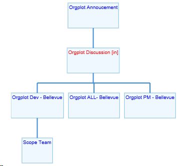
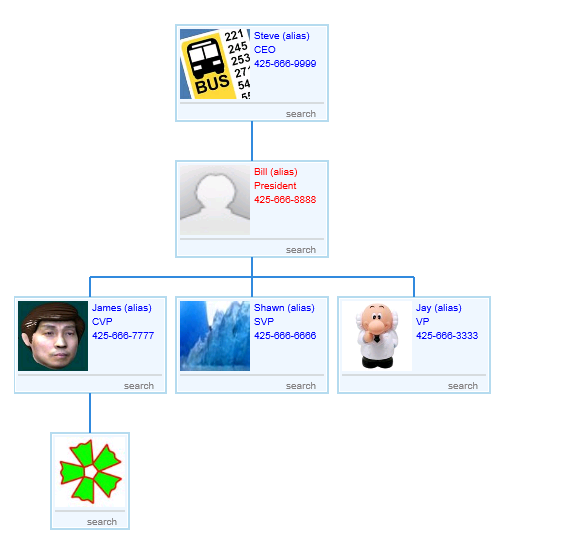

# orgchart
HTML5 canvas to draw organizational chart with JSON input / API build. 

OrgChart is a JS library which draws org (organization) chart (tree) for your tree data.

It requires HTML5 canvas.

#### **Example*1*:**

#### **Example*2* (images display, like name card):**

To see the source code sample, please go to test folder
